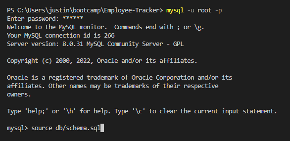
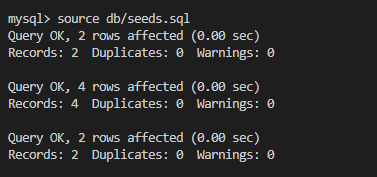
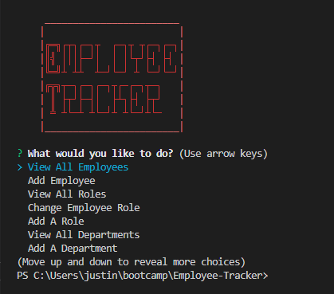
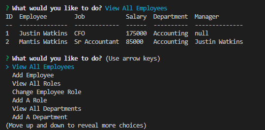
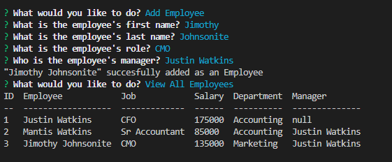
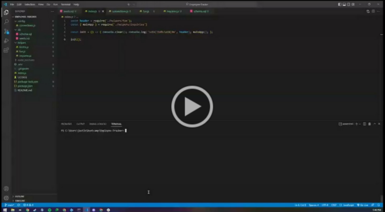

# **Employee Tracker**


## **Description**

This project is an Employee Tracker that uses Inquirer to connect to a MYSQL database that let's you track your employees, job roles, departments and salaries. This was a large project and the first I've done involving mySQL. The dependencies used in this were mySQL2, inquirer, console.table and I also used dotenv to keep SQL passwords secure. Dealing with all the data coming from inquirer and translating that into SQL queries was a challenging task that took a while.

You can find a video walkthrough here: [https://drive.google.com/file/d/1T2N6Ud-YPWpuypWlvbEZNHD3GMfTfODM/view](https://drive.google.com/file/d/1T2N6Ud-YPWpuypWlvbEZNHD3GMfTfODM/view)

---

## **Table of Contents**

* [Installation](#installation)

* [Usage](#usage)

* [Screenshots](#screenshots)

* [Video](#video)

* [License](#license)

* [Contributing](#contributing)

* [Tests](#tests)

* [Questions](#questions)

---

## **Installation**

To install the needed dependencies, run the following commands:

```
npm i 
```

To set up the database, run:

```
mysql -u root -p

source db/schema.sql
```

If you want to add sample data, run:

```
source db/seeds.sql
```

---

## **Usage**

To use this project you'll need to run 'npm i' in your terminal to install the needed dependencies. Then you'll also need to create a .env file in the root directory of the project or you can edit lines 32 and 33 of the app.js file if you want to hardcode your SQL login credentials. 

Once that is done you'll need to login to mySQL in the terminal and source db/schema.sql. If you want to seed it with some initial data there is also a sample seeds.sql file in the same folder.

---

## **Screenshots**

First login to mysql using `mysql -u root -p` and then source the schema:



(OPTIONAL) If you want to add sample data to the SQL database source the seeds.sql file: 



Exit out of mysql by typing `exit` then run `npm i` in the console to install the needed dependencies. Once that's done, run `npm start` to start the program:



From here you can use the program how you see fit. Below are just some examples of what it looks like when you add an employee and then view the employee list again.





---

## **Video**

A video on how to install and run this program can be viewed by clicking the screenshot below: 

[](https://drive.google.com/file/d/1T2N6Ud-YPWpuypWlvbEZNHD3GMfTfODM/view)

Or clicking this link: [https://drive.google.com/file/d/1T2N6Ud-YPWpuypWlvbEZNHD3GMfTfODM/view](https://drive.google.com/file/d/1T2N6Ud-YPWpuypWlvbEZNHD3GMfTfODM/view)

---

## **License**

This project is licensed under the MIT license.

---

## **Contributing**

You can contribute to this project by submitting issues to the github repo or by emailing me directly. You can find my contact info at the bottom of this readme! 

---

## **Tests**

To test the project, run the following commands:

```
N/A
```

---

## **Questions**

If you have any questions about the project or repo, contact me directly at justincodingclass@gmail.com or open an issue on the repo. You can find my github profile with this project and others at [github.com/jwatkins28](https://github.com/jwatkins28/)
